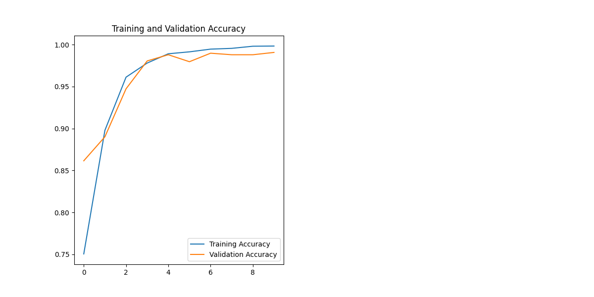

<<<<<<< HEAD
=======
Here's an improved version of your README.md file for the Gender Detection System project. I've incorporated all the elements you mentioned, including sections on accuracy, application usage, and detailed explanations of each file's purpose.

```markdown
>>>>>>> 218a964 (final push)
# Gender Detection System

This repository contains a gender detection system built using TensorFlow and Keras, designed to classify faces as male or female. The project includes model training, prediction scripts, and a graphical user interface (GUI) for easy interaction. The model achieved an accuracy of **99.08%** during training.

<<<<<<< HEAD
 <!-- Replace with the actual path to your accuracy plot -->
 <!-- Replace with the actual path to your losses plot -->
=======
 <!-- Replace with the actual path to your accuracy plot -->
 <!-- Replace with the actual path to your losses plot -->
>>>>>>> 218a964 (final push)

## Table of Contents

- [Installation](#installation)
- [Project Structure](#project-structure)
- [Training the Model](#training-the-model)
- [Testing the Model](#testing-the-model)
- [Usage](#usage)
- [Contributing](#contributing)
- [License](#license)
- [Credits](#credits)

## Installation

Before you begin, ensure you have the following prerequisites installed:

- Python 3.12 or higher
- TensorFlow
- Keras
- OpenCV
- Tkinter (for GUI)

You can install the required Python packages using pip:

```bash
pip install tensorflow keras opencv-python
```

## Cloning the Repository

To clone or fork this repository, use the following command:

```bash
git clone https://github.com/2310030224-PranayVarma/Gender_Detection_System_ML.git
```

## Project Structure

```plaintext
Gender_Detection_System_ML/
├── face_detection_system/
|   ├── data_preprocessing
|   |   ├── __init__.py         # Initialize the preprocessing package
|   |   └── preprocess.py       # Functions for preprocessing images
│   ├── dataset/
│   │   └── [Male and Female face datasets]  # Contains the dataset used for training
│   ├── inference/
│   │   ├── gui.py              # GUI for user interaction
│   │   ├── predict.py          # Script for making predictions on single images
│   │   └── webcam_predict.py    # Script for real-time predictions using webcam
|   ├── evaluation
|   |   ├── confusion_matrix.py  # Generates confusion matrix for model evaluation
|   |   └── evaluate.py          # Evaluates the model's performance
│   ├── models/
│   │   ├── __init__.py         # Initialize the models package
│   │   ├── model.py            # Defines the neural network architecture
|   |   ├── best_model.keras     # Best model saved during training
│   │   └── gender_detection_model.keras # Final trained model
|   ├── notebooks
|   |   ├── EDA.ipynb           # Exploratory Data Analysis
|   |   ├── ModelEvaluation.ipynb # Model evaluation procedures
|   |   └── ModelTraining.ipynb   # Training process and results
│   └── training/
│       ├── train.py            # Script for training the model
|       └── utils.py            # Utility functions for training and evaluation
├── README.md                    # Project documentation
├── LICENSE                      # License information
└── requirements.txt            # List of required packages
```

## Training the Model

To train the model, navigate to the `training` directory and run the following command:

```bash
python train.py
```

Make sure your dataset is properly structured within the `dataset` folder.

## Testing the Model

To test the trained model, you can use the `predict.py` or `webcam_predict.py` scripts found in the `inference` directory.

## Usage

1. **Run the GUI**:
   ```bash
   python gui.py
   ```
   This will launch a graphical user interface for uploading images.
   

2. **Make Predictions**:
   - Use the GUI to upload an image or capture a photo using your webcam.
   - The model will classify the face as male or female.
   ![IMAGE PREDICTION OF A FEMALE IMG DATA] (image.png)
## Application and Usages

- **Real-time Gender Detection**: Utilize the webcam for live detection.
- **Image Classification**: Analyze existing images to classify gender.
- **Educational Purposes**: Learn about gender classification and machine learning techniques.

## Contributing

Contributions are welcome! If you have suggestions for improvements or features, please create a pull request or open an issue.

## License

This project is licensed under the MIT License. See the [LICENSE](LICENSE) file for details.

## Credits
<<<<<<< HEAD

- **TensorFlow**: Open-source machine learning framework.
- **OpenCV**: Library for computer vision tasks.
- **Kaggle Dataset**: [Male and Female Faces Dataset](https://www.kaggle.com/datasets/ashwingupta3012/male-and-female-faces-dataset/)

=======

- **TensorFlow**: Open-source machine learning framework.
- **OpenCV**: Library for computer vision tasks.
- **Kaggle Dataset**: [Male and Female Faces Dataset](https://www.kaggle.com/datasets/ashwingupta3012/male-and-female-faces-dataset/)
```

### Notes:
- Replace `path/to/accuracy_plot.png` and `path/to/losses_plot.png` with the actual paths to your accuracy and loss plots.
- Ensure all links and descriptions accurately reflect your project structure and details.
- Feel free to modify any section as per your preferences!
>>>>>>> 218a964 (final push)
